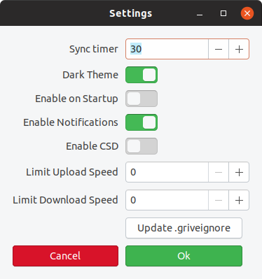

# Grive Indicator


# Linux Gtk indicator to sync Google Drive via Grive

A very simple and lightweight indicator applet to synchronize with Google Drive using grive.

Works with "selective sync". You can specify one folder to sync (only one). That is permanent and cannot be changed.

# Install

 ## Dependencies

- grive (https://github.com/vitalif/grive2)
- python3-gi
- python3-requests
- gir1.2-appindicator3-0.1
- gir1.2-gtk-3.0

## Ubuntu

On ubuntu run:
```sh
sudo apt install python3-gi python3-requests gir1.2-appindicator3-0.1
```

## Snap

The snap can be built and installed via 
```sh
snapcraft cleanbuild
snap install grive-indicator_master_amd64.snap --classic --dangerous
```

It will pull grive as well, so it can be installed also if it is unavailable in the host system.

# Usage

## First Run

Select folder and .griveignore.

It will run grive -a, open a webpage and ask for the code, parsing the cli.

## Settings

Change multiple settings from a simple ui:
- A timer between sync intervals
- The theme for the appindicator icon
- Enable the program on startup
- Enable notifications
- Limit upload/download speeds
- Open the griveignore file for editing

[](settings.png)

# Tests

Run ./runtests in the project root.

At the moment only pycodestyle(pep8) settings are checked.

----
The icons are copyright © Sam Hewitt, from the Paper Icons theme, available under the terms of the CC-BY-SA-4.0 license.
